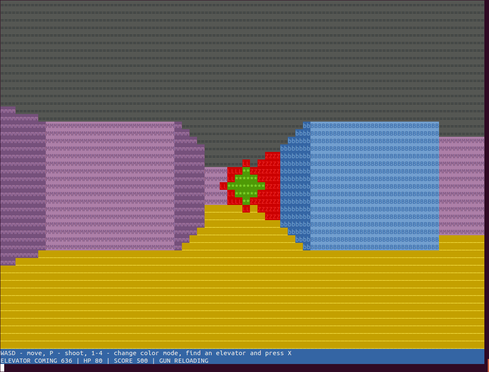

# awkaster
Bring some old-school fun to your terminal! Explore the dungeon and shoot monsters in this pseudo-3D game inspired by the classic Wolfenstein 3D and Doom.

#Running the game
`gawk -f awkaster.awk`

You need `gawk` version >= `4.0.0`

#How to play
Your objective is to navigate the map and activate exit elevator, killing hoards of monsters in the process.

Controls:
* WASD - movement
* p - shoot
* num 1-4 - change color mode (4 is my favorite)
* x - activate elevator (arrives after 1000 moves)

#Adjusting resolution
By default game resolution is 64x48 "pixels", which are just a pair of ASCII symbols. That means your terminal needs to be at least 128 chars wide. You may change variables `w` and `h` to your liking.

#Game engine
Wall rendering is done using ray casting. Monsters and projectiles are added after that as sprites.
Ray casting is a simple rendering algorithm that doesn't require any 3d modeling or complex computation.

You can find an excellent tutorial here:
http://lodev.org/cgtutor/raycasting.html

#OSX

OSX users neeg to have gawk installed.

Using Homebrew do:

    homebrew update
	
	brew install gawk

Your machine will now be ready to run it.
